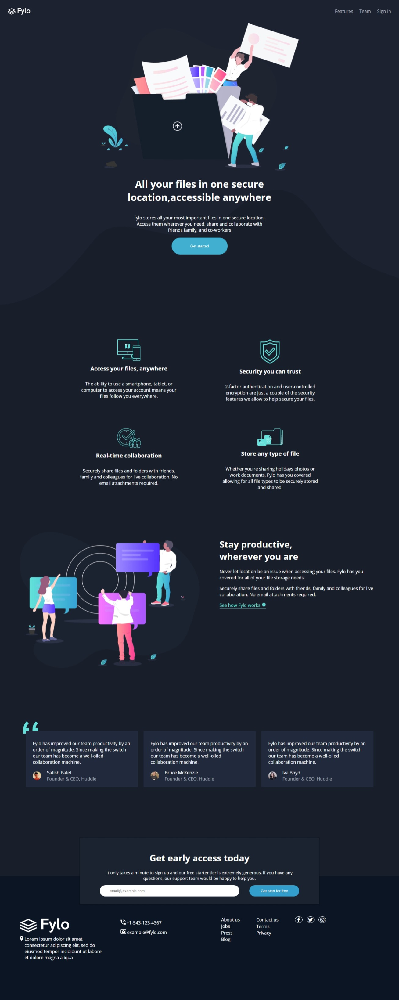
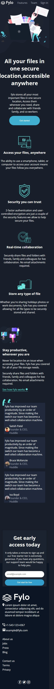

# Frontend Mentor - Fylo dark theme landing page solution

This is a solution to the [Fylo dark theme landing page challenge on Frontend Mentor](https://www.frontendmentor.io/challenges/fylo-dark-theme-landing-page-5ca5f2d21e82137ec91a50fd). Frontend Mentor challenges help you improve your coding skills by building realistic projects. 

## Table of contents

- [Overview](#overview)
  - [The challenge](#the-challenge)
  - [Screenshot](#screenshot)
  - [Links](#links)
- [My process](#my-process)
  - [Built with](#built-with)
- [Author](#author)

## Overview

### The challenge

Users should be able to:

- View the optimal layout for the site depending on their device's screen size
- See hover states for all interactive elements on the page

### Screenshot
### computer screen

### mobile screen

### Links

- Solution URL: [solution](https://www.frontendmentor.io/solutions/htmlcssflexboxfont-awesome-rxGnM58Yk)
- Live Site URL: [live site](https://gigagiorgadze.github.io/fylo-dark-theme-landing-page-master/)

## My process

### Built with

- Semantic HTML5 markup
- CSS custom properties
- Flexbox
- font awesome

## Author

- Website - [Giga Giorgadze](https://gigagiorgadze.github.io/personal-portfolio/)
- Frontend Mentor - [@GigaGiorgadze](https://www.frontendmentor.io/profile/GigaGiorgadze)
- Twitter - [@giorgadze_11](https://www.twitter.com/giorgadze_11)

